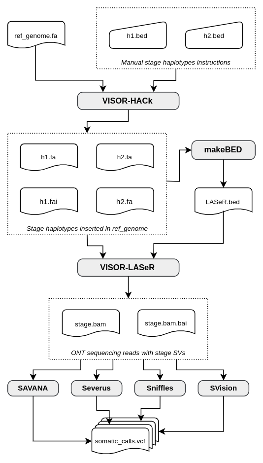

# visor-simulations: a workflow for testing SV callers with custom synthetic data

## Introduction

visor-simulations is a **[Snakemake](https://snakemake.readthedocs.io/en/stable/) 
workflow** that simulates long-read sequencing data of human genomes with 
somatic structural variations (SVs) using 
**[VISOR](https://github.com/davidebolo1993/VISOR)**, allowing for 
low-cost and accurate estimation of the precision and recall of SV calling methods 
(**[SAVANA](https://github.com/cortes-ciriano-lab/savana)**, 
**[Severus](https://github.com/KolmogorovLab/Severus)**, 
**[Sniffles2](https://github.com/fritzsedlazeck/Sniffles)** 
and **[SVision-pro](https://github.com/songbowang125/SVision-pro)**). The use of 
the software tools described herein is based on my **[master's thesis
in bioinformatics](https://github.com/villena-francis/master_thesis)**. However, alternative 
and more complex configurations are possible.

The workflow leverages Snakemake's integration with the Conda package manager to 
automatically manage software requirements and dependencies. **It 
is designed for use on an HPC system and is not recommended for 
laptops or workstations**, as VISOR-LASeR requires significant CPU and RAM 
resources, and the generated long-read sequencing data files (BAM and FASTQ) 
demand substantial storage space.

> As an illustrative example, simulating a human genome with 30x coverage in 
> approximately 20 hours requires the use of 52 threads, about 180 GB of RAM, 
> and 200 GB of storage space for the resulting BAM and FASTQ files.

## Workflow overview

This is a simplified diagram of the workflow steps:

<p align="center">
    <picture>
    <source media="(prefers-color-scheme: dark)" srcset="resources/fig/overview_dark.svg">
    <source media="(prefers-color-scheme: light)" srcset="resources/fig/overview_light.svg">
    
    </picture>
</p>

## Usage

### 1. Download visor-simulations from GitHub

Use the git clone command to create a local copy of the repository.

```shell
git clone https://github.com/villena-francis/visor-simulations
```

### 2. Set up the environment

This pipeline requires a [conda package manager](https://docs.conda.io/projects/conda/en/latest/user-guide/install/index.html) and [bioconda](https://bioconda.github.io/). It is also essential to 
install [Snakemake](https://snakemake.readthedocs.io/en/stable/index.html), 
which in this case, will be set up in a Conda environment. 

> Using a Snakemake environment ensures working with a fixed version, preventing
> potential issues when re-running the pipeline after general software updates.

```shell
# Navigate to the visor-simulations directory
cd /path/to/visor-simulations
# Create the environment
conda env create -f workflow/envs/snakemake_visor.yaml
```

### 3. Get the input files

#### Reference genome

VISOR-HACk requires a reference genome to insert structural variations (SVs) and 
simulate reads. This genome should be placed in the `resources/genome/` directory. 
You can obtain the genome from various sources. A possible method to download and 
prepare it is described below.

```shell
# Navigate to the visor-simulations directory
cd /path/to/visor-simulations
# Download the human genome from GENCODE
wget -nc -P resources/genome https://ftp.ebi.ac.uk/pub/databases/gencode/Gencode_human/release_46/GRCh38.primary_assembly.genome.fa.gz
# Descompress the file
gunzip -vk resources/genome/GRCh38.primary_assembly.genome.fa.gz
# Generate a new fasta without unlocalized sequences
samtools faidx resources/genome/*genome.fa chr1 chr2 chr3 chr4 chr5 chr6 chr7 chr8 chr9 chr10 chr11 chr12 chr13 chr14 chr15 chr16 chr17 chr18 chr19 chr20 chr21 chr22 chrX chrY > resources/genome/GRCh38_ref.fa
```

#### BAM instruction files

VISOR-HACk requires BAM files containing instructions for the SVs to be inserted 
into the reference genome. Each celular clone, referred to as "stages" in this 
work, consists of a folder with two BAM files located in `resources/`. Each file 
represents a set of genetic variations found in one of the chromosome pairs. To 
perform somatic SV calling, two **type of stages** are required:

* **normal**. This stage essentially consists of two empty haplotype BED format 
files (HACk.h1.bed and HACk.h2.bed) to generate reads without any alterations.

* **tumour**. This stage type requires instructions on the SVs to insert into 
the reference genome. Folders in this category were named as v1, v2, v3 and so
on. The format for generating these files is available in the 
[VISOR documentation](https://davidebolo1993.github.io/visordoc/usage/usage.html#visor-hack).

### 4. Set up the configuration file 

Before executing the workflow, it's necessary to adjust the `config/config.yaml`.
In this file, you should indicate the reference genome name, the directory names 
for tumor stages, sequencing coverages for simulations, the number of replicas 
for combining these elements, the tools for SV calling, and the type of 
sequencing reads (e.g., Nanopore or PacBio). Additionally, there is a resource 
management section for each rule, with parameters already optimized for average 
efficiency in any scenario related to the master's thesis for which it was 
created.

### 5. Run the workflow

To run the workflow, navigate to the `visor-simulations` directory, activate the 
Conda environment **snakemake_visor**, and execute the Snakemake command with the 
arguments specified below. The first time you run the workflow, it will take a 
few minutes to set up Conda dependencies.

```shell
# Navigate to the visor-simulations directory
cd /path/to/visor-simulations
# Activate the environment
conda activate snakemake_visor
# Run the workflow (example with the Slurm workload manager)
snakemake --use-conda -j unlimited --executor slurm
```

## Workflow steps

Here you will find a comprehensive overview of the Snakemake rules that 
constitute the workflow.

### 1. visor_hack

This step uses a reference genome and stage-specific BED instruction files to 
generate FASTA haplotype files (h1.fa, h2.fa) with incorporated SVs and their 
respective indices (.fai). The output is stored in `results/{stage}_HACk`.

### 2. generate_bed

A custom script, makeBED.sh, extracts the maximum chromosome sizes from the 
h1.fa and h2.fa files to create a BED file (laser.simple.bed) containing the 
maximal sizes of each chromosome. The output is saved in `results/{stage}_HACk`.

### 3. visor_laser_tumour

Using the reference genome, FASTA haplotype files, and their respective 
laser.simple.bed, VISOR-LASeR generates a file with raw long-reads (.fastq) and 
another with reads aligned using minimap2 to the reference genome (sim.srt.bam) 
in `results/{stage}_{coverage}x_{replicate}_LASeR`.

> The config parameters "replicates" and "coverage" determine the number of 
> directories generated, enabling synthetic data creation at various coverages 
> and replicates for one or more stages. 

### 4. visor_laser_normal

This rule is automatically triggered by rules requiring somatic SV calling. It 
executes VISOR-LASeR to produce a normal sample in 
`results/normal_{coverage}x_LASeR`, where the coverage matches that of the 
outputs from the visor_laser_tumour rule.

> Snakemake ensures that only one normal sample is generated per coverage level 
> simulated for tumor samples, avoiding redundant execution if a normal sample 
> for the specified coverage already exists.

### 5. savana, severus, sniffles, svision

These rules use the BAM files generated by the visor_laser_tumour and 
visor_laser_normal rules to produce respective somatic SV calls. The outputs are 
stored in `results/{stage}_{coverage}x_{replicate}_{caller}`.

## Aditional: subsampling of BED outputs

To ensure the accuracy and identify potential errors in SV callers, it is 
essential to conduct a preliminary assessment of simulation quality by 
visualizing BAM file reads. To facilitate this process, I have developed 
[**bam-splitter**](https://github.com/villena-francis/bam-splitter), a workflow 
for chromosomal splitting of whole-genome BAM files.
